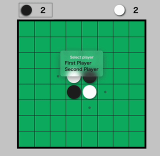

# Othello

Othello written in Rust

## Othello WebAssembly

- `othello-alphazero/`

[Yew](https://github.com/yewstack/yew) + ONNX([tract](https://github.com/sonos/tract))

GitHub pages: <https://near129.github.io/othello/>

## Othello AlphaZero

<!-- AlphaZeroのNNのモデルを学習する -->
Script to train alpha zero nural network

- `othello-alphazero/train_model/main.py` script to train model
- `othello-alphazero/selfplay/main.rs` selfplay and create train data (prallel processing)
- `othello-alphazero/selfplay/vs_random.rs` alphazero vs random (prallel processing)
